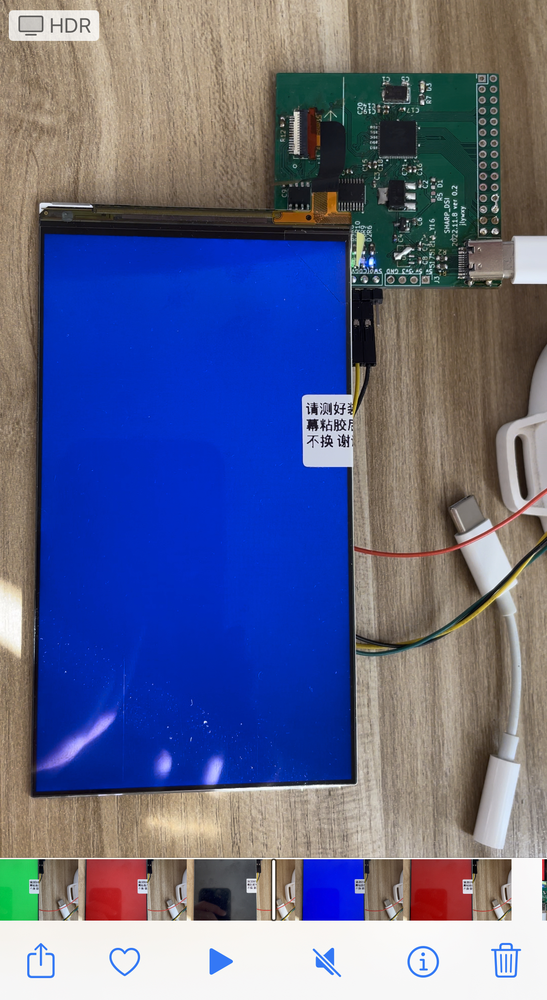

# MIPI-DSI Interface LCD Driver for Sharp LS050T1SX01 using SSD2828

Note: this project is in a working process, <b>but most part of the work has been done.</b> The document and code comments are still needed to be finshed and polished.
<br>
```
Current Progress

[ok] LCD with Specification
[ok] SSD2828 SPI Transmission and Initialization
[ok] SSD2828 and LCD MIPI Configuration
[ok] Circuit Schematic
[ok] PCB Layout and MIPI Differential Layout
[ok] First Test and Debug
[  ] Final Test
```
- --

Author: jlywxy<br>
Document Version: 1.0.2
- --
## Content Catalog and Overview
```
Availability Test
Circuit Schematic Suggestions
PCB Layout and Manufacturing Suggestions
Overview of the LCM Interface
Display Workflow(Steps to light up display)
Misc
```

This project is managing to drive Sharp LS050T1SX01 using SSD2828(Solomon Systech) and STM32F030F4P6.
```
(any)  |  <- RGB interface
       v
       ---->  SSD2828 ------> Sharp LS050T1SX01
       ^                 ^ MIPI
STM32  |  <- SPI
```
- --
## Availability Test
1. Since this LCM need signal converting, a PCB is made, include power management.
Checkout <a href="sharp_dsi_pcb">sharp_dsi_pcb</a> directory for PCB(using KiCad).

2. Test method until now is using SSD2828 BIST mode to display color at full screen. <br>
The testing signal frequency is 992 MHz (0.99GHz), with ideal frame rate at 120 Hz.<br>
 

- --

## Circuit Schematic Suggestions

1. Use reverse voltage generator IC for LCD AVDD+/-.<br>
Currently using ICL7660 from Renesas.
2. Put KiCad PWR_FLAG at VBUS/GND at USB-C connector.
3. Use 3.3v LDO to VDDIO for LCD, SSD2828 and STM32.
4. To be continued
- --
## PCB Layout and Manufacturing Suggestions
1. For MIPI Differential Layout
* Do not use LCEDA to tune line length using the tuning function only for single-ended network. Use a more professional tool such as KiCad(in this project) or Altium, then use their tuning function for two lines of the differential, concurrently.
* The MIPI lines must cross the connector on the reverse side of the connector, and make via holes between the pads in the connector.
```
------------------......
| | | | | | |
 ø ø ø ø ø ø ......
ø ø ø ø ø ø 
 | | | | | | | ......
------------------

("|"=pad, "ø"=via-holes)
```
2. For connector soldering and layout
* Do not use heat gun to solder plastic components, even if temperature is lower than 220(C).
* Do not use low temperature soldering tin (accurately 138(C)Bi-Sn), which is not rock-hard then spliting apart and cause <b>rosin joint</b>
* Make connector direction easy for LCD connection.
* Make soldering pad bigger to conveniently solder connector on the board.
* To solder connector on the board using iron, put tin and rosin on the footprint of PCB, then remove them to make a thin layer. Put tin on the iron header, and put connector on the PCB, use iron header to touch connector pin, especially reload the tin in the pad on the PCB. If tin on the pad are gathering together, dip some rosin to the PCB to make them apart, or use copper strip to suck the tin off. After soldering, a visual check should be applied as: tin should connect the pad surface and connector pin, making a small tin curve; no tin is still gathering.
3. For PCB Manufacturing
* Use KiCad to plot Gerber and drill files, then zip the files and send to manufacture.
* It is tested using JLCPCB to manufacture the board.
The gerber settings for JLCPCB should be modified as follow:
```
---Gerber Options------------------------
*[yes] Use Protel filename extensions
*[no]  Generate Gerber job file
*[yes] Subtract soldermask from silkscreen

      Coordinate format: 4.6, unit mm
*[no]  USe extended X2 format(recommended)
*[no]  Include netlist attributes
[no]  Disable aperture macros(not recommended)

---Drill Units------------------------
*[yes] Millimeters
[no]  Inches

*: modified options compared to the default settings
```
4. To be continued
- --
## Overview of the LCM Interface 

### 1. Display Interface

This LCM is using MIPI DSI and DCS interface.
```
Sharp LS050T1SX01

Electrical-Level    | Speed       | Driver IC
--------------------------------------------------
1.2v-330mV-MIPI DSI | max 500 MHz | Renesas R63311

Wires                    | VDD Voltage
--------------------------------------------------
1port,4lanes(2CLK+8Data) | 1.8/3.3v(digital), +5v & -5v(analog)
```

### 2. Backlight Interface

This LCM requires 19.8v dual power with each 20mA current without internal backlight driver.

### 3. Connector

The part number of Mating connector is AYF333135 of Panasonic, which has 31pins with crossing 0.3mm interval.

This is the only one connector on the LCM to provide data/control/backlight lines.


- --

## Display Workflow(Steps to light up display)

0. Backlight power on.
1. LCM VDD on, XRES.
2. Initialize SSD2828: Set LP Mode, PLL, VSYNC/HSYNC, Color Mode, BIST...
3. Write init conf to LCD via SSD2828 MIPI Packet
4. Write 0x29,0x11 to LCD
5. SSD2828 Enters HP Video Mode

- --
## Misc

### LCM Optical Characteristics

```
Sharp LS050T1SX01

Pixel-Arrangement   | Panel-Type | Color-Depth
-------------------------------------------------
RGB vertical stripe | IPS        | 8-bit(16.7M)


Contrast | Color-Chromaticity | Backlight
-------------------------------------------------
1000:1   | 72% NTSC(sRGB)     | 450 nits
```

### Knowledge Bases of Concepts
1. MIPI DSI
* The MIPI Alliance defines modern interface of mobile devices like phones, including display, cameras, etc. 

< TO BE CONTINUED >

2. MIPI DPI & DCS


* MIPI-DPI is one of the MIPI display interface series, which is well known as RGB/Parallel/LTDC interface. This interface splits control lines(HSYNC/VSYNC/DE) with data lines(RGB parallel lines). Since it uses single-ended signals(compared to MIPI-DSI), the max speed(clock speed) could be limited, but it can transfer full pixel data in one clock period(compared to serial interfaces). The color depth is configurable as RGB565/RGB666/RGB888 and more, which could also be 'hacked' to leave out some pins or branch some lines(when downsampling color depth, throw away certain LSB; when upsampling, branch certain MSB to LSB or connect certain LSB to GND).
```
RGB888 (typical format of 16.7M color display)
-------------------------------------------------
       RRRRRRRR GGGGGGGG BBBBBBBB (3 bytes)

RGB666 (typical format of 262k color display, and 16.2M color TN panels with FRC)
-------------------------------------------------
             RR RRRRGGGG GGBBBBBB (18 bits)

RGB565
-------------------------------------------------
                RRRRRGGG GGGBBBBB (2 bytes)

RGB101010 (not available in most of the displays, typical format of 1.07B color screen)
-------------------------------------------------
RRRRRR RRRRGGGG GGGGGGBB BBBBBBBB (30 bits)
```

* MIPI-DCS: DCS command and Generic command

< To Be Continued >

4. LCM

* A abbreviation of Liquid Crystal Module, which includes LCD glass panel and backlight LEDs.

5. Low-Temperature Soldering Tin

* A type of soldering tin which melting point is only 138 celsius high. It has 58% Bismuth(Bi) and 42% Stannum(Sn) to make such a low melting point. This temperature is so important for those not heat-resistant components such as LEDs and MEMS components. However, it's definitely not recommended for connector soldering, which will cause unsoldering and rosin-joint, because this type of soldering tin is fragile.

### Another performance tests
1. SSD2828 and LCD overclock is viable.(See Availablity Test above)
2. Using 3.3v or lower voltage for LCD AVDD+/- may still take the screen 'alive', but with lower brightness.
